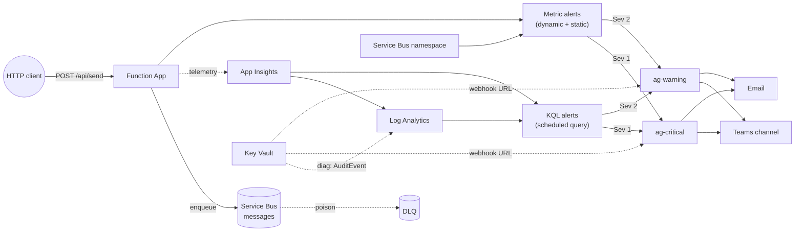

# Azure Alerting

Production-grade Azure alerting baseline. Terraform-provisioned Function App + Service Bus stack with a comprehensive alerting layer covering rate-based percentages, dynamic-baseline anomaly detection, dead-letter-queue growth, and dependency failures. Notifications route via severity-split action groups to Microsoft Teams and email.

Intended as the mainline starting point for new Azure workloads — opinionated, but every decision is documented and overridable.

## Contents

- [Architecture](#architecture)
- [Quick Start](#quick-start)
  - [Prerequisites](#prerequisites)
  - [Infrastructure](#infrastructure)
  - [Deploy the function](#deploy-the-function)
  - [Run locally](#run-locally)
  - [Trigger an alert](#trigger-an-alert)
  - [Alert simulation modes](#alert-simulation-modes)
  - [Full alert test suite](#full-alert-test-suite)
- [Per-environment variable suggestions](#per-environment-variable-suggestions)
  - [Alert threshold overrides](#alert-threshold-overrides)
- [Resources Created](#resources-created)
- [Alerts](#alerts)
  - [Severity model](#severity-model)
  - [Action groups](#action-groups)
  - [Sev 1 — Critical](#sev-1--critical)
  - [Sev 2 — Warning](#sev-2--warning)
  - [Design rationale](#design-rationale)
  - [Diagnostic settings](#diagnostic-settings)
  - [Tagging](#tagging)
  - [Known limitations](#known-limitations)
- [Cost analysis](#cost-analysis)
  - [Pricing model](#pricing-model)
  - [Per-alert cost](#per-alert-cost)
  - [Supporting infrastructure](#supporting-infrastructure)
  - [Cost-reduction options](#cost-reduction-options)
  - [Caveats](#caveats)
- [Compliance and governance](#compliance-and-governance)
  - [PII handling — what the stack collects](#pii-handling--what-the-stack-collects)
  - [PII redaction strategy](#pii-redaction-strategy)
  - [GDPR posture](#gdpr-posture)
  - [Architecture governance — what's in place](#architecture-governance--whats-in-place)
- [Suggested improvements](#suggested-improvements)
  - [Alerting-pipeline watchdog](#alerting-pipeline-watchdog)
  - [SLO / burn-rate alerts](#slo--burn-rate-alerts)
  - [Alert-processing rules](#alert-processing-rules)
  - [Real runbook content](#real-runbook-content)
  - [Remote state backend](#remote-state-backend)
- [Project Structure](#project-structure)

## Architecture

- **Infrastructure as Code** — Terraform with local state and Key Vault secret management
- **Application** — .NET 10 isolated Azure Function (HTTP trigger → Service Bus queue)
- **Alerting** — 11 alerts across 2 severity tiers, routed via 2 severity-split action groups to Teams + email



See [`docs/superpowers/specs/2026-05-24-rate-based-alerts-design.md`](docs/superpowers/specs/2026-05-24-rate-based-alerts-design.md) for the current alerting design; historical design records live in [`docs/plans/`](docs/plans/).

## Quick Start

### Prerequisites

- Azure CLI  
  ```powershell
  winget install --id Microsoft.AzureCLI
  az login
  ```
- Terraform >= 1.6
- .NET 10 SDK
- Azure Function Core Tools  
  ```powershell
  winget install --id Microsoft.AzureFunctionsCoreTools
  ```

### Infrastructure

```powershell
# Provision resources (local state — no backend bootstrap)
cd terraform
copy terraform.tfvars.example terraform.tfvars
# Edit terraform.tfvars with your Teams webhook URL
terraform init
terraform plan
terraform apply
```

State is held in `terraform/terraform.tfstate` (gitignored). For shared or production use, switch to a remote backend (Azure Storage with locking, Terraform Cloud, etc.) before promoting beyond a single operator's machine.

### Deploy the function

The function app is a .NET 10 isolated worker. Publish with the Azure Functions Core Tools:

```powershell
cd terraform
$funcName = terraform output -raw function_app_name
cd ../src/AzureAlerting.Function
func azure functionapp publish $funcName
```

No app settings to configure — the managed identity authenticates to Service Bus and Storage automatically.

For CI pipelines, trigger the same tool programmatically:

```powershell
cd terraform
$funcName = terraform output -raw function_app_name
cd ../src/AzureAlerting.Function
func azure functionapp publish $funcName
```

### Run locally

```powershell
cd src/AzureAlerting.Function
func start
```

### Trigger an alert

The function uses `AuthorizationLevel.Function` — callers must pass a function key as the `code` query parameter:

```powershell
cd ../terraform
$rg   = terraform output -raw resource_group_name
$name = terraform output -raw function_app_name
$url  = terraform output -raw function_app_url
cd ..

$key  = az functionapp keys list --resource-group $rg --name $name --query "masterKey" -o tsv
$body = '{"test": true}'
Invoke-RestMethod -Uri "$url/api/send?code=$key" -Method Post -Body $body -ContentType "application/json"
```

Or use the convenience script which auto-resolves the URL and key:

```powershell
./scripts/trigger-alerts.ps1
```

### Alert simulation modes

The function supports simulation query parameters for testing alert rules without
relying on real infrastructure failures. Append them to the `/api/send` URL:

| Parameter | Value | Behaviour | Alerts triggered |
|---|---|---|---|
| `simulateFailure` | `true` | Throws a `ServiceBusException` and returns 500 | `function_failure_rate`, `dependency_failure_rate`, `send_failure_spike` |
| `simulateDelay` | milliseconds | Delays processing by N ms before sending to the queue | `function_p95_response_time` |
| `simulateTimeout` | seconds (or `true` for 230s) | Sleeps for N seconds, then returns 504 | `function_timeout_rate` |

Parameters can be combined — `?simulateFailure=true&simulateDelay=1000` fails
after a 1s delay.

**Examples:**

```powershell
# Trigger a failure (500)
Invoke-RestMethod -Uri "$url/api/send?code=$key&simulateFailure=true" -Method Post -Body '{}' -ContentType "application/json"

# Trigger a slow response (3s delay)
Invoke-RestMethod -Uri "$url/api/send?code=$key&simulateDelay=3000" -Method Post -Body '{}' -ContentType "application/json"

# Trigger a timeout (~230s)
Invoke-RestMethod -Uri "$url/api/send?code=$key&simulateTimeout=true" -Method Post -Body '{}' -ContentType "application/json" -TimeoutSec 300

# Combine: fail after a delay
Invoke-RestMethod -Uri "$url/api/send?code=$key&simulateFailure=true&simulateDelay=1000" -Method Post -Body '{}' -ContentType "application/json"
```

### Full alert test suite

`scripts/trigger-alerts.ps1` exercises 6 of the 11 alerts with a single run:

| Mode | Alert(s) exercised |
|---|---|
| `spike` (20 rapid requests) | `execution_spike` (Sev 2) |
| `failure` (8 simulated 500s) | `function_failure_rate`, `dependency_failure_rate`, `send_failure_spike` (Sev 1) |
| `delay` (8 slow responses, 3s delay) | `function_p95_response_time` (Sev 2) |
| `timeout` (optional, ~230s each) | `function_timeout_rate` (Sev 2) |
| `backlog` (700 messages) | `aged_messages` (Sev 2) |

Pass `-Alert` to run a single mode, or omit it to run all five in order:

```powershell
./scripts/trigger-alerts.ps1 -Alert failure
./scripts/trigger-alerts.ps1 -Alert all   # default
```

After `backlog`, drain the queue with:

```powershell
./scripts/drain-messages.ps1
```

The three alerts that can't be script-triggered:

- **`dlq_growth`** — requires a consumer that rejects messages repeatedly.
  No consumer is deployed with this stack.
- **`kv_access_failure`** — requires actual Key Vault auth failures.
  Simulating this would break the webhook secret lookup.
- **`sb_throttling`** — requires hitting the Service Bus Standard tier
  throttle limit, which this workload is unlikely to reach.

## Per-environment variable suggestions

The same module deploys to any environment; only the `.tfvars` differ. Suggested values:

| Variable | `dev` | `uat` | `prod` | Notes |
|---|---|---|---|---|
| `environment` | `dev` | `uat` | `prod` | Used in resource group name and tags. |
| `project_name` | `az-alerting` | `az-alerting` | `az-alerting` | Same across envs so resource names sort together in the portal. |
| `location` | `uksouth` | `uksouth` | `uksouth` (+ UK West DR pair) | Prod usually adds a paired-region replica plan; out of scope here. |
| `teams_webhook_url` | webhook for `#alerts-dev` | webhook for `#alerts-uat` | webhook for `#alerts-prod` | Separate Teams channels per env — keeps dev noise out of the prod feed. |
| `notification_emails` | `["dev-team@example.com"]` | `["qa@example.com","dev-team@example.com"]` | `["sre-oncall@example.com","incidents@example.com"]` | Dev: developers only. UAT: QA + dev. Prod: on-call rotation + incident bridge. |
| `bu` | `` | `` | `` | Business unit that owns this stack. |
| `runbook_base_url` | `https://runbooks.example.com/dev` | `https://runbooks.example.com/uat` | `https://runbooks.example.com/prod` | Optional split; a single URL works if runbooks are environment-agnostic. |
| `log_analytics_retention_days` | 30 | 30 | 90 | First 31 days free; longer incurs per-GB charges. |
| `key_vault_soft_delete_retention_days` | 7 | 7 | 7 | Must be 7–90 inclusive. |
| `service_bus_message_ttl_days` | 7 | 7 | 7 | Messages older than this are dead-lettered or dropped. |

### Alert threshold overrides

Every alert threshold is exposed through a single `alert_thresholds` object variable. Defaults are dev-grade — looser, so active development does not generate constant noise. Tighten in `uat` and `prod` by overriding the object in the respective `.tfvars`.

Suggested values per environment:

| Threshold | `dev` (defaults) | `uat` | `prod` | What it controls |
|---|---|---|---|---|
| `min_request_floor` | 5 | 20 | 50 | `total >= N` floor on the percentage-based KQL alerts; below this, the rate calculation is suppressed to avoid divide-by-tiny flapping. |
| `failure_rate_pct` | 10 | 5 | 3 | Percentage threshold for `function_failure_rate`. |
| `timeout_rate_pct` | 10 | 5 | 3 | Percentage threshold for `function_timeout_rate`. |
| `dependency_failure_rate_pct` | 10 | 5 | 3 | Percentage threshold for `dependency_failure_rate`. |
| `p95_response_time_ms` | 3000 | 2000 | 2000 | `function_p95_response_time` ceiling in milliseconds. |
| `execution_spike_threshold` | 100 | 200 | 500 | Execution-count ceiling over 15 minutes for `execution_spike`. Tune to your workload's normal throughput. |
| `active_messages_threshold` | 10 | 300 | 100 | `aged_messages` metric alert — `ActiveMessages` average ceiling over 15m. |
| `send_failure_spike_count` | 5 | 2 | 2 | `send_failure_spike` event-count threshold in 5m. |
| `dlq_growth_delta` | 0 | 0 | 0 | `dlq_growth` dead-letter message threshold. Stays at 0 in all envs — any poison message is worth paging. |

`auto_mitigation_enabled` on KQL alerts (scheduled query rules) is **not** included as a per-env knob: Sev 1 stays `false` across all environments. Metric alerts do not have this setting — they resolve when conditions clear.

Example `uat` override:

```hcl
alert_thresholds = {
  min_request_floor                = 20
  failure_rate_pct                 = 5
  timeout_rate_pct                 = 5
  dependency_failure_rate_pct      = 5
  p95_response_time_ms             = 2000
  execution_spike_threshold        = 200
  active_messages_threshold        = 300
  send_failure_spike_count         = 2
  dlq_growth_delta                 = 0
}
```

## Resources Created

- App Service Plan (Flex Consumption FC1, Linux)
- Function App (.NET 10 isolated)
- Application Insights (workspace-based)
- Log Analytics Workspace
- Storage Account
- Service Bus Namespace + Queue (DLQ enabled)
- Key Vault (Teams webhook secret)
- 2 Action Groups (critical, warning)
- 1 Diagnostic Setting (Key Vault → Log Analytics)
- 11 Metric/Log Alerts (see [Alerts](#alerts))

## Alerts

Eleven alerts ship across two severity tiers, routed by severity to two Azure Monitor action groups. Both action groups deliver to Teams + email so a webhook outage does not silence the pipeline.

### Severity model

- **Sev 1 — Critical:** user-impacting or data-at-risk. Page-now in a real on-call setup. `auto_mitigation_enabled = false` — stays open until acknowledged.
- **Sev 2 — Warning:** degraded behaviour or anomalous traffic. Investigate during business hours. Auto-resolves when conditions clear.

A Sev 4 watchdog tier is **not** currently shipped. See [Suggested improvements](#suggested-improvements) for the rationale and the proposed paths to add one.

### Action groups

| Group | Receivers | Used by |
|---|---|---|
| `ag-critical-${project}` | Teams webhook + every address in `notification_emails` | Sev 1 alerts |
| `ag-warning-${project}` | Teams webhook + every address in `notification_emails` | Sev 2 alerts |

Both action groups use the common alert schema (`use_common_alert_schema = true`) so metric and log alerts arrive in the same payload shape.

### Sev 1 — Critical

| Alert | Type | Signal | What it tells you |
|---|---|---|---|
| `function_failure_rate` | KQL on App Insights `requests` | failure % > threshold with total ≥ `min_request_floor` over 5m | User-facing 5xx is a real fraction of traffic. |
| `execution_heartbeat` | KQL on App Insights `requests` | `count() == 0` over 15m | No function executions at all in the window — likely degraded or dead. |
| `dependency_failure_rate` | KQL on App Insights `dependencies` | dep-failure % > threshold with total ≥ `min_request_floor` over 5m | Outbound calls (Service Bus, Key Vault, etc.) are failing — even if requests still return 200. |
| `send_failure_spike` | KQL on App Insights `exceptions` | `Azure.Messaging.ServiceBus*` exception count > threshold in 5m | Burst of messaging-client exceptions — the queue path is broken. Filters by exception type, not log text. |
| `dlq_growth` | Metric | `DeadletteredMessages` > 0 over 15m, split by `EntityName` | Any queue has dead-lettered messages. Dimension-split so each entity fires independently. |
| `kv_access_failure` | KQL on `AzureDiagnostics` | `SecretGet`/`SecretList` failures > 0 over 15m | Secret reads are failing — would silently break the action group's webhook lookup. |

### Sev 2 — Warning

| Alert | Type | Signal | What it tells you |
|---|---|---|---|
| `function_p95_response_time` | KQL on App Insights `requests` | `percentile(duration, 95)` > threshold with total ≥ `min_request_floor` over 5m | P95 latency regression. Genuinely measures P95 (the metric-based alert that used average response time has been replaced). |
| `function_timeout_rate` | KQL on App Insights `requests` | timeout % (resultCode 408/504 or duration ≥ 230s) > threshold over 5m | Handler timeouts are a real fraction of traffic. |
| `execution_spike` | KQL on App Insights `requests` | `count() > threshold` over 15m | Execution count above configured threshold — scraper, retry storm, runaway client. |
| `aged_messages` | Metric | `ActiveMessages` average > threshold over 15m, split by `EntityName` | Backlog accumulating — consumer is slow or stuck. Dimension-split so each queue fires independently. |
| `sb_throttling` | Metric | `ThrottledRequests` > 0 over 5m | Service Bus namespace is at tier capacity. Leading indicator to scale to Premium. |

### Design rationale

- **Why both metric and log alerts.** Platform metrics (Azure Monitor) are cheap, fast, and pre-aggregated, but they can't detect *absence* of data, can't filter on log content, and can't divide one signal by another. KQL log-query alerts cover those cases — percentages of total traffic, deltas across windows, exception-type filtering, audit-log queries. Each alert is on the cheapest tool that can actually answer the question. Note: the two execution-rate alerts (`execution_heartbeat`, `execution_spike`) use KQL rather than metrics because Flex Consumption metric namespaces aren't registered until the first execution; KQL queries against App Insights are immediately available and cover all invocation types.
- **Why two action groups instead of one.** A single webhook is a single point of failure: a webhook rotation, Teams outage, or secret-retrieval failure silences every alert at once. Splitting by severity decouples Sev 1 routing from Sev 2 noise. Email is the out-of-band backup so a webhook failure does not blind the operator.
- **Why percentage rates, not counts.** A single failed request, single timeout, or single DLQ entry is noise at production traffic levels. Alerts fire on *sustained* fractions of traffic (5% with a `total >= 5` floor for the request-side alerts) so single events don't page.
- **Why `auto_mitigation_enabled = false` on every Sev 1 KQL alert.** Critical signals should not silently auto-resolve while the underlying issue may persist. An operator acknowledges them. Metric alerts (`azurerm_monitor_metric_alert`) do not support this field — they auto-resolve when their criteria clear naturally.
- **Why metric for Service Bus alerts.** `ActiveMessages`, `DeadletteredMessages`, and `ThrottledRequests` are all native Azure Monitor metrics — no Log Analytics ingestion or KQL evaluation is needed. All three Service Bus alerts are pure metric alerts with dimension splits on `EntityName` so each queue fires independently.
- **Why exception-type filter for `send_failure_spike`.** The previous implementation matched `message contains "Failed to send"`. A future log-message reword would silently break the alert. Filtering by exception `type` (auto-captured by App Insights from `LogError(ex, ...)`) survives log rewrites.

### Diagnostic settings

One diagnostic setting ships the data the KQL alerts depend on:

- `diag-kv-${project}` — Key Vault `AuditEvent` + `AllMetrics` → Log Analytics (powers `kv_access_failure`).

### Tagging

Every alert and action group carries:

- `environment`, `project` — pre-existing taxonomy.
- `owner` — from `var.bu`. Used to route on-call ownership.
- `severity_class` — `critical`, `warning`, or `informational`. Used by alert-processing rules.
- `runbook` — per-alert URL under `var.runbook_base_url`. Surfaces the operator runbook directly from the alert.

### Known limitations

These are genuine open items, not shortcuts:

- **No alerting-pipeline watchdog.** Nothing in the stack tells you when Azure Monitor itself has stopped firing alerts. See [Suggested improvements](#suggested-improvements) for the design options under consideration.
- **Runbooks are placeholders.** URLs in alert descriptions point at `var.runbook_base_url` (default `https://runbooks.example.com/azure-alerting`). Actual runbook content is a separate workstream.
- **No SLO / burn-rate alerts.** Multi-window error-budget burn alerts (e.g., 2% / 1h and 5% / 6h on a 99.9% target) replace static thresholds with something tied to a real availability commitment. The file layout supports adding them in `alerts_function.tf` without restructuring.
- **No alert-processing rules.** Maintenance-window suppression and on-call routing rules are not configured; planned deploys will fire spurious alerts until added.
- **Default thresholds are first-principles.** The per-environment values suggested above (dev/uat/prod) are reasoned guesses, not validated against this workload's real traffic. Re-tune once historical metrics exist. Window sizes (5m / 10m / 15m) remain hardcoded — promoting those to variables is a follow-up if you find them too coarse or too fine.

## Cost analysis

> Region: UK South. Prices are approximate GBP figures, converted from Microsoft's USD list prices at roughly 0.80 USD → GBP. Azure Monitor pricing changes periodically and Microsoft's local-currency pricing may differ by a few percent from a direct conversion — validate against the [official pricing page](https://azure.microsoft.com/en-gb/pricing/details/monitor/) before committing to a budget. Traffic assumptions below are placeholders; actual numbers depend on workload behaviour and need to be revisited.

### Pricing model

Three things are billed:

1. **Alert rules** — flat monthly charge per rule, tiered by type and evaluation frequency.
2. **Log Analytics ingestion** — ~£1.80/GB for everything written to the workspace by App Insights and the Key Vault diagnostic setting. This is usually the dominant line item.
3. **Action group notifications** — email and webhook are effectively free at the volumes this stack produces.

Metric alerts charge per *time-series* monitored (one per dimension combination). Log-query (KQL) alerts charge per *rule*, independent of how many results the query returns.

### Per-alert cost

| Alert | Type | Eval freq | Est. £/month | Notes |
|---|---|---|---|---|
| `function_p95_response_time` | KQL on `requests` | 5m | ~£0.40 | Queries App Insights data already ingested for other purposes. |
| `function_timeout_rate` | KQL on `requests` | 5m | ~£0.40 | Same. |
| `function_failure_rate` | KQL on `requests` | 5m | ~£0.40 | Same. |
| `dependency_failure_rate` | KQL on `dependencies` | 5m | ~£0.40 | Same App Insights tables. |
| `send_failure_spike` | KQL on `exceptions` | 5m | ~£0.40 | Same. |
| `dlq_growth` | Metric, static | 15m | ~£0.08 | Native metric — no diagnostic setting needed. Dimension split on EntityName. |
| `kv_access_failure` | KQL on `AzureDiagnostics` | 15m | ~£0.16 | Depends on the Key Vault diagnostic setting. |
| `execution_heartbeat` | KQL on `requests` | 5m / 15m window | ~£0.40 | Same tables as other function alerts. |
| `execution_spike` | KQL on `requests` | 5m / 15m window | ~£0.40 | Same. |
| `aged_messages` | Metric, static | 15m | ~£0.08 | Native metric — no diagnostic setting needed. Dimension split on EntityName. |
| `sb_throttling` | Metric, static | 5m | ~£0.08 | One time-series. |
| **Subtotal: 11 alert rules** | | | **~£3.20** | |

### Supporting infrastructure

| Item | Est. $/month | Notes |
|---|---|---|
| 2 action groups (critical, warning) | £0 | Email free up to 1000/month; webhook free up to 100k/month. |
| Key Vault diagnostic setting | <£0.08 | AuditEvent volume is very low. |
| Log Analytics retention | Free for first 31 days, then ~£0.08/GB/month | Negligible at low volume. Tunable via `log_analytics_retention_days`. |
| **Log Analytics ingestion (App Insights)** | **£1–£8 at low volume; £40+ at moderate prod traffic** | Driven by request volume, exception rate, dependency calls — not by alert rules. |

### Cost-reduction options

Ranked by impact:

1. **Cut Log Analytics ingestion.** Set `sampling_percentage` on `azurerm_application_insights` (e.g., 20% in dev/uat). Largest line item, smallest code change. Currently unset, defaults to 100%.
2. **Filter low-value telemetry** at the workspace via ingestion-time transformations (drop noisy dependency traces, suppress success-only entries).

4. **Drop alerts whose value doesn't justify their cost** in a specific environment (e.g., `sb_throttling` in environments that will never approach Standard SKU limits).

### Caveats


- Pricing here ignores ancillary costs that are not part of the alerting layer itself: Function App execution, Service Bus messaging operations, Key Vault transactions, Storage account. Those scale with workload, not with the alerts.
- All figures assume a single Azure region. Multi-region deployments multiply most line items.

## Compliance and governance

This section captures what the stack does and doesn't do today around personal data, GDPR posture, and architecture controls. It is **not** a formal compliance assessment — use it as a starting point for one.

Platform-level controls — network exposure, Private Endpoints, Defender for Cloud baselines, Azure Policy enforcement, Activity Log archival, customer-managed keys, subscription-level guardrails — are owned by the landing zone / platform team and are intentionally out of scope for this workload repository.

### PII handling — what the stack collects

The workload code is intentionally minimal in what it logs:

- **Function logs** (`SendMessageFunction`) emit only the `CorrelationId` (a fresh GUID per request), the `BodySize` in bytes, and the Service Bus `MessageId` (equal to the correlation ID). The **request body is never logged or written to App Insights** — it goes directly to the Service Bus message body and the function never logs it.
- **Service Bus message body** is a pass-through of whatever the HTTP caller posted. If callers send PII in their JSON payload, that PII is at rest in the queue for up to the queue TTL (`P7D` — 7 days). The queue is not a long-term store; messages should be consumed and processed within minutes.
- **Exception handling** uses a generic error string (`"Failed to send message to Service Bus queue"`); the response does **not** echo the request body or any details that could leak input data.
- **Application Insights default telemetry** captures request URL (`/api/send`, no query string used), method, duration, response code, and client IP. App Insights IP masking is on by default in this configuration (last octet of IPv4 / last segment of IPv6 zeroed); we do not set `disable_ip_masking = true`.
- **Custom dimensions** in App Insights from this code: `CorrelationId`, `BodySize`, `MessageId`, plus the `Source = "az-alerting"` application property. None are PII.
- **Key Vault diagnostic setting** ships `AuditEvent`, which records each secret access with caller object ID, caller IP, and operation name. Caller IP here is GDPR-relevant for service-principal usage; partial masking is **not** applied to this category.

### PII redaction strategy

The current code avoids logging PII entirely — request bodies are never written to App Insights and the function emits only correlation IDs, byte counts, and generic error strings. This is a "log nothing sensitive" posture rather than a redaction-based one. If future work introduces logging that could carry PII (e.g., richer error context, request headers, or queue-dead-letter inspection), redaction should be applied at the **producer side** (inside the function) before data leaves the process — not post-hoc in Log Analytics.

#### What to redact

Any field whose purpose is to carry user-provided or identity-linked data:

| Category | Examples | Default action |
|---|---|---|
| **Personally identifiable data** | Email addresses, phone numbers, national ID numbers, IP addresses (full), physical addresses | Replace with `<REDACTED>` or hash with a consistent salt |
| **Credentials and secrets** | API keys, tokens, connection strings, `Authorization` headers | Replace with `<REDACTED>` — never hash; hashing secrets is reversible if the keyspace is known |
| **Financial data** | Credit card numbers, bank account numbers, payment references | Replace with `<REDACTED>` or tokenize via a vault lookup |
| **Request bodies with unknown schema** | Arbitrary JSON posted by callers | Pluck out known-safe top-level fields (e.g., correlation ID, trace context) and discard the rest; never log the full body |
| **Exception data** | Exception messages re-echoing user input, stack traces with file paths from build machines | Use generic error strings; strip `StackTrace` or `InnerException.Message` if they could embed input values |

#### Implementation approach

Three layers, applied in order:

1. **Structured logging guardrails.** The `ILogger` extension methods should only accept named parameters (`LogInformation("Processing {CorrelationId}", id)`) — never raw string interpolation (`$"Processing {id}"`). A Roslyn analyzer or lint rule can enforce this. This prevents accidental PII concatenation into the `message` field.

2. **Redaction middleware / delegating handler.** A middleware layer in the HTTP pipeline (or a wrapper around `ILogger`) that:
   - Hashes or replaces known PII patterns before they reach the log sink.
   - Runs on a configurable allow-list of properties (e.g., `CorrelationId`, `BodySize`, `MessageId` — everything else is dropped or redacted by default, opt-in rather than opt-out).
   - For ILogger calls, intercepts structured log-state values and redacts any key not on the allow-list.

3. **Telemetry processor for App Insights.** An `ITelemetryProcessor` (or `ITelemetryInitializer` for enrichment) that:
   - Sanitizes `RequestTelemetry.Properties` and `TraceTelemetry.Properties` to remove keys not on the allow-list.
   - Strips `ExceptionTelemetry.Exception.StackTrace` unless an explicit opt-in flag is set.
   - Masks the client IP in `RequestTelemetry` beyond the default last-octet masking if the jurisdiction requires it (App Insights defaults to partial masking; full masking sets `DisableIPMasking = true` in reverse — the property name is unfortunately double-negative; see [Microsoft docs](https://learn.microsoft.com/en-us/azure/azure-monitor/app/ip-collection)).

#### Redaction at the workspace level (fallback)

If producer-side redaction is not feasible in a given iteration (e.g., a third-party library emits PII), Log Analytics **workspace-level ingestion-time transformations** can scrub data after ingestion but before it is queryable. This is a last-resort safety net, not the primary strategy, because:

- Transformations run on every row ingested and add latency + cost.
- They are KQL-based and harder to test than in-code redaction.
- They cannot retroactively redact data that was ingested before the transformation was deployed.

For App Insights data specifically, ingestion-time transformations are **not supported** — App Insights tables bypass workspace-level transforms. PII in App Insights therefore must be caught before the SDK serializes it (layer 3 above).

#### Verification

Redaction coverage should be tested by:

1. **Unit tests** that feed known-PII payloads through the redaction middleware and assert no PII reaches the log output.
2. **Integration smoke tests** in a non-production environment that fire requests with synthetic PII patterns and query App Insights to confirm none appear in `traces`, `requests`, or `exceptions`.
3. **Periodic audit queries** against the Log Analytics workspace scanning for known PII patterns (email regex, credit-card Luhn checks) — run as a scheduled notebook or a KQL alert with informational severity.

### GDPR posture

- **Data residency.** All resources default to `uksouth`. UK is covered by the EU adequacy decision, so EU/UK personal data stays in-scope without additional Standard Contractual Clauses.
- **Cross-border destinations.** Alert notifications leave Azure: Teams webhook payloads land in Microsoft Teams (residency depends on the M365 tenant's data location), and emails land in the addresses listed in `notification_emails` (wherever those mailboxes are hosted). Confirm the Teams tenant region and ensure recipient mailboxes are in approved jurisdictions before promoting beyond dev.
- **Alert payload leakage.** Both metric alerts and KQL log alerts include alert context in the webhook/email payload. For KQL alerts, that context includes the matched rows — meaning fields like client IP, exception stack traces, or correlation IDs reach the Teams channel and the email recipients. Anyone with access to those destinations sees a slice of the observability data.
- **Retention.** Log Analytics workspace retention (var `log_analytics_retention_days`, default `30 days`); Service Bus queue TTL (var `service_bus_message_ttl_days`, default `7 days`); Key Vault soft-delete retention (var `key_vault_soft_delete_retention_days`, default `7 days`). Tunable per environment via `.tfvars`.
- **Data subject rights.** No mechanism for subject access requests, erasure, rectification, or portability is wired into this stack. App Insights supports a `purge` API, but it's manual and not exposed here.
- **Lawful basis.** This stack does not collect personal data on its own behalf; if the upstream workload does, document the basis in the workload's own privacy notice.
- **Processor.** Microsoft is the data processor; the standard Microsoft Online Services DPA applies.

### Architecture governance — what's in place

- **Identity:** Function App uses a System-Assigned Managed Identity for Service Bus access (`Azure Service Bus Data Sender` role). No shared keys or connection strings for messaging.
- **Authorisation on the HTTP trigger:** `AuthorizationLevel.Function` — callers must present a function key, not anonymous.
- **Secrets:** The Teams webhook URL is stored in Key Vault and referenced by the action group rather than being checked in.
- **Encryption:** All Azure services use platform-managed keys at rest and TLS in transit. No customer-managed keys (CMK) configured.
- **Audit trails:** Function/dependency/exception telemetry → App Insights. Key Vault `AuditEvent` and Service Bus `AllMetrics` → Log Analytics.
- **Tagging:** `environment`, `project`, `owner`, plus per-alert `severity_class` and `runbook` tags.

## Suggested improvements

Open follow-ups for taking the alerting layer beyond the current baseline. Ranked by impact, not by effort.

### Alerting-pipeline watchdog

Today there is no signal that tells operators when Azure Monitor itself has stopped firing alerts. An earlier iteration shipped a hourly KQL heartbeat (`alerting_watchdog`), but its synthetic query stayed permanently in the "firing" state — it emitted one email at creation and then went silent, the opposite of what a heartbeat should do. The alert and its dedicated action group were removed. Three viable paths to replace it:

1. **External dead-man's switch.** A service outside Azure (Healthchecks.io, PagerDuty heartbeat, Cronitor, or a small ping consumer in another cloud) expects a regular ping and alerts when one is missing. Azure side: a Logic App or timer-triggered Function that pings the external service hourly. Survives a regional Azure outage. Recommended as the eventual target.
2. **In-Azure Logic App or timer-triggered Function.** A `Microsoft.Logic/workflows` recurrence trigger every hour sends an email directly to the operator address list. Stays in Azure, costs ~£0 at Consumption tier. Does not survive a regional outage but is significantly cheaper to operate than Option 1.
3. **Meta-alert on alerting-plane inactivity.** A KQL alert against `AlertsManagementResources` that fires when zero alerts of any kind have been evaluated in the last 24h. Doesn't give a regular tick but catches the actual failure mode the watchdog is meant to detect.

Option 3 is the minimum-viable improvement; Option 1 is the production-grade target.

### SLO / burn-rate alerts

The current alerts use static-percentage thresholds (`> 5%` failure rate, etc.). A more mature setup defines an availability SLO (e.g., 99.9% over 30 days) and alerts on **error-budget burn rate** — for example, fire fast on 2% budget consumed in 1h, and slow on 5% consumed over 6h. The file layout (`alerts_function.tf`) supports adding these as a fourth tier without restructuring.

### Alert-processing rules

Currently absent. Two natural uses:

- **Maintenance-window suppression** — silence non-Sev-1 alerts during planned deploys so operators don't get paged by self-inflicted noise.
- **Severity-based routing** — send Sev 1 to an on-call rotation (PagerDuty, Opsgenie) while leaving Sev 2 in chat. Easier than action-group changes because rules layer on top of existing groups.

### Real runbook content

Alert descriptions embed `${var.runbook_base_url}/<alert-slug>` URLs that today point at a placeholder host. Writing the actual per-alert runbooks (cause, diagnosis steps, mitigation, escalation path) is a separate workstream that this repo does not own.

### Remote state backend

Local state is fine for the single-operator setup this repo targets today. Any shared use (CI deployments, two-operator team, environment promotion) needs a remote backend with locking — Azure Storage with the legacy lock leases, or Terraform Cloud / HCP Terraform.

## Project Structure

```
├── terraform/
│   ├── providers.tf
│   ├── variables.tf
│   ├── locals.tf
│   ├── key_vault.tf
│   ├── function_app.tf
│   ├── service_bus.tf
│   ├── alerts.tf              # action groups
│   ├── alerts_function.tf     # function / App Insights alerts
│   ├── alerts_servicebus.tf   # Service Bus alerts + diag setting
│   ├── alerts_infra.tf        # Key Vault alert + diag setting
│   ├── outputs.tf
│   └── terraform.tfvars.example
├── src/
│   └── AzureAlerting.Function/
│       ├── Program.cs
│       ├── SendMessageFunction.cs
│       ├── IServiceBusSenderFactory.cs
│       ├── ServiceBusSenderFactory.cs
│       ├── host.json
│       ├── local.settings.json
│       └── AzureAlerting.Function.csproj
├── tests/
│   └── AzureAlerting.Function.Tests/
│       ├── SendMessageFunctionTests.cs
│       └── AzureAlerting.Function.Tests.csproj
├── scripts/
│   ├── trigger-alerts.ps1
│   └── drain-messages.ps1
└── docs/
    ├── plans/                          # historical design + plan
    └── superpowers/
        ├── specs/                      # current design
        └── plans/                      # current implementation plan
```
